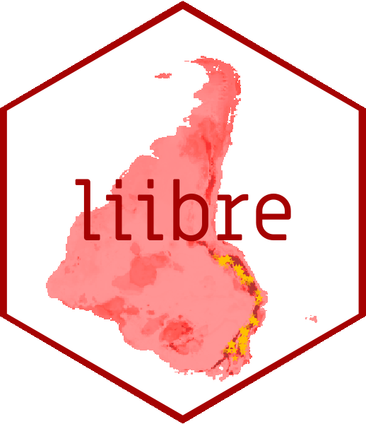

# “Do *script* ao pacote de R - um exemplo desde a biologia”

Esta apresentação foi realizada dia 23/07/2020 no Meetup de R-Ladies+
Rio de Janeiro. Os slides foram criados usando o pacote **xaringan**.

A gravação do *meetup* será disponibilizada no nosso canal de
[Youtube](https://www.youtube.com/channel/UCGwTYiK7vTePhPpDRgQAq_A/featured)

Faça parte\! [Meetup R-Ladies+ Rio de
Janeiro](https://www.meetup.com/pt-BR/rladies-rio/)

## Links para material citado:

  - Data Feminism: <http://datafeminism.io/>
  - Painel de R Forwards sobre diversidade e inclusão na comunidade de R
    [useR\! 2020
    panel](https://www.youtube.com/watch?v=gDO1OphmF5Q&t=18s)
  - Meetup anterior, por @saramortara
    [Apresentação](https://www.youtube.com/watch?v=4nfIbiS1Huw&t=1583s)
    e [Tutorial](https://github.com/saramortara/R-git-tutorial)

## Pacotes de exemplo

  - Pacote **modleR** <https://model-r.github.io/modleR/> (Sánchez-Tapia
    et al. )
  - Pacote **coronabr** <https://liibre.github.io/coronabr/index.html>
    (Mortara, Sánchez-Tapia, Martins)
  - Pacote **R-Ladies antifa**
    <https://github.com/liibre/rladies_antifa> (Mortara & Sánchez-Tapia)

## Sobre git

  - Livro Pro Git <https://git-scm.com/book/en/v2>

## Alguns exemplos de estilo de código

  - [Google’s R style
    guide](https://google.github.io/styleguide/Rguide.html)
  - [tidyverse](https://style.tidyverse.org/)
  - [Advanced R](http://adv-r.had.co.nz/Style.html)

