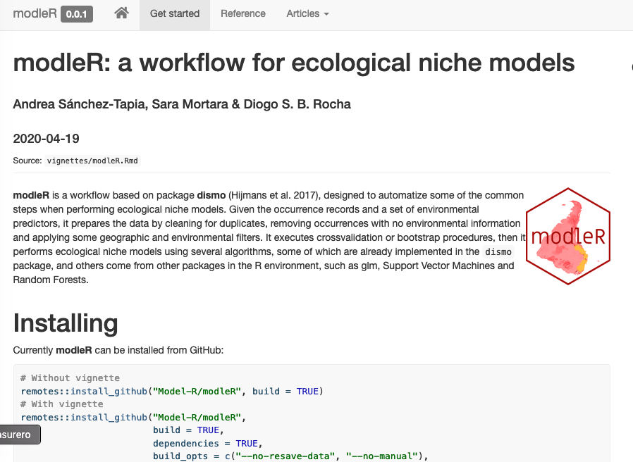

class: inverse, middle, center
background-image: url("figs/chevron.png")
background-position: 98% 2%
background-size: 150px

# Do _script_ ao pacote de R
## um exemplo desde a biologia
### Andrea Sánchez-Tapia <br> Núcleo de Computação Científica e Geoprocessamento <br> Jardim Botânico do Rio de Janeiro
### R-Ladies Rio de Janeiro


---
background-image: url("figs/chevron.png")
background-position: 98% 2%
background-size: 150px

```{r setup, include=FALSE}
options(htmltools.dir.version = FALSE)
options(servr.daemon = TRUE)#para que no bloquee la sesión
library(xaringanthemer)
style_duo_accent(
  primary_color = "#562457",
  secondary_color = "#562457",
  colors = c(
    red = "#A70000",
    purple = "#88398a",
    orange = "#ff8811",
    green = "#136f63",
    blue = "#4B4FFF",
    white = "#FFFFFF",
    black = "#181818"
  ),
  text_bold_color = "#181818",
  header_font_google = google_font("Roboto Condensed"),
  text_font_google = google_font("Roboto Condensed", "300", "300i"),
  code_font_google = google_font("Fira Mono"), text_font_size = "25px"
)
```
### Apresentação


+ Bióloga - Universidade Nacional da Colômbia  
+ Mestre em Ecologia - UFRJ
+ Doutora em Botânica - JBRJ
+ .purple[Pós-doc - Núcleo de Computação Científica e Geoprocessamento do JBRJ]

Ecologia de comunidades vegetais, restauração ecológica, ecologia quantitativa  

__Informática da biodiversidade__, modelagem de nicho ecológico

__Ciência aberta e reprodutível__, ética na ciência de dados, ciência de dados feminista

--


```{r, echo = FALSE, out.width = 100}
knitr::include_graphics("./figs/df.jpg")
```

Catherine D'Ignazio & Lauren Klein [http://datafeminism.io/](http://datafeminism.io/)


---
background-image: url("figs/chevron.png")
background-position: 98% 2%
background-size: 150px

### Apresentação

+ Como trabalhar apenas com software _libre_? 

+ Usuária de `R` desde 2009

+ .purple[R-Ladies Rio de Janeiro] desde 2017

+ __O alvo hoje__: Executar e ensinar a fazer projetos de análise reprodutíveis. Desde o _download_ e processamento de dados até produzir o manuscrito, relatório ou apresentação (__rmarkdown__, __knitr__)

 <!-- + Co-fundadora .red[__¡liibre!__] com Sara Mortara: laboratório de informática da biodiversidade e reprodutibilidade em ecologia --> 
---
class: center, middle
background-image: url("figs/chevron.png")
background-position: 98% 2%
background-size: 150px


.pull-left[
### Curso _Projetos de análise de dados usando R_

```{r, echo = FALSE, out.width= 300}
knitr::include_graphics("./figs/turma.JPG")
```


```{r, echo = F, out.width= 100}

#knitr::include_graphics("./figs/liibre.png")
```

__Sara Mortara__ (R-Ladies Rio de Janeiro)
]


.pull-right[
<br>
<br>
<br>
<br>
<br>
__Boas práticas__ em análise de dados

```{r, echo = F, out.width=200}
knitr::include_graphics("./figs/rstudio.jpg")

```

```{r, echo = F, out.width= 80}
knitr::include_graphics("./figs/logo-git.png")
knitr::include_graphics("./figs/GitHub_Logo.png")
knitr::include_graphics("./figs/btibucket.png")
knitr::include_graphics("./figs/gitlab-logo-gray-rgb.png")
```

```{r, echo = F, out.width= 100}
knitr::include_graphics("./figs/latex.jpeg")
knitr::include_graphics("./figs/bibtex.jpeg")
knitr::include_graphics("./figs/zotero.svg")
```
```{r, echo = F, out.width= 50}
knitr::include_graphics("./figs/rmarkdown.png")
```

```{r, echo = F, out.width= 60}
knitr::include_graphics("./figs/xaringan.png")
```
]


 <!-- pensada como seminário
 alunes de várias áreas do conhecimento
 ferramentas que não têm um ensino formal
 de grande utilidade --> 

---
background-image: url("figs/chevron.png")
background-position: 98% 2%
background-size: 150px

### Por que pensar em pacotes?

+ Filosofia de R: transição de usuárie a programadore

--

+ Filosofia da __R Foundation__ e de __R Forwards__: mais raças, gêneros, países, línguas representados na comunidade de R ([useR! 2020 panel](https://www.youtube.com/watch?v=gDO1OphmF5Q&t=18s))

--

+ Úteis para compartilhar grandes conjuntos de funções que têm um propósito similar

--

+ Grande experiência de aprendizado: portabilidade, transparência, robusteza, comunicação. 

--

#### Habilidades que vale muito a pena aprender _bem antes_ de chegar ao pacote


---
class: middle
background-image: url("figs/chevron.png")
background-position: 98% 2%
background-size: 150px

### Pacote de R para modelagem de nicho <br> ecológico: .red[modleR]

+ __Unificar__ diferentes partes do processo de MNE
+ Fornecer __metadados__ e __documentar__ decisões de parametrização
+ Se __integrar__ ao resto de ferramentas que existem no ambiente de `R`

<br>
```{r, echo = FALSE, out.width= 151}
knitr::include_graphics("./figs/mm.png")
```
```{r, echo = FALSE, out.width= 600}
knitr::include_graphics("./figs/coleguinhes.png")
```

<small>
Marinez F Siqueira, Sara Mortara, Diogo Rocha, Guilherme Gall, Felipe Sodré
</small>

.pull-left[

`r icon::fa("firefox")` 
<small>
[https://model-r.github.io/modleR/](https://model-r.github.io/modleR/)
</small>
]

.pull-right[
<p style="text-align:center;">

`r icon::fa("youtube")` 

<small>
<a href="https://www.youtube.com/watch?v=4Xw33TdIVXA">Aula no curso ENM-2020</a>

</small>
</p>

]

---
class: bottom, center
background-image: url("figs/modleR.png")
background-position: 50% 0%
background-size: 800px

```{r, echo = FALSE, out.width= 800}
knitr::include_graphics("./figs/preprint.png")
```


---
background-image: url("figs/chevron.png")
background-position: 98% 2%
background-size: 150px

### Modelos de nicho ecológico ou de <br> distribuição das espécies (ENM, SDM)

+ Dados de ocorrência das espécies: __objetos espaciais__, bases de dados, limpeza de dados.

+ Camadas preditoras ambientais ( __rasters__ de SIG)  Pacotes __`raster`__, __`sp`__, __`maps`__, __`rgdal`__: (taskview Spatial)

+ Abordagem de aprendizado estatístico 

+ Diferentes algoritmos
 
+ __Inferência de áreas adequadas para a ocorrência das espécies__

---
background-image: url("figs/chevron.png")
background-position: 98% 2%
background-size: 150px

### A história

#### O trabalho: gerar uma camada de diversidade potencial de plantas <br> da Mata Atlântica

+ A "maior" quantidade possível de espécies
+ Muito controle sobre a qualidade dos dados e dos modelos
+ Correção taxonômica, limpeza dos registros
+ Alta resolução (30s ~1km) 

--

#### O fluxo de trabalho: cada espécie precisa passar por várias etapas

+ Obtenção, __limpeza__ de dados
+ Desenho experimental, __preparação__ dos dados
+ Ajustar os __modelos__, __projetar__ os modelos para vários algoritmos
+ Juntar os resultados dos diferentes algoritmos
+ Juntar o resultado para várias espécies

---
class: inverse, middle, center
background-image: url("figs/chevron.png")
background-position: 98% 2%
background-size: 150px

### A gente já conhecia algumas boas práticas

---
background-image: url("figs/chevron.png")
background-position: 98% 2%
background-size: 150px

### Boas práticas `r emojifont::emoji('heart')` <br> estrutura de pastas e pasta de trabalho 

+ ___Meetup_ anterior!__  `r icon::fa("youtube")`[Apresentação](https://www.youtube.com/watch?v=4nfIbiS1Huw&t=1583s) e  `r icon::fa("github")` [Tutorial](https://github.com/saramortara/R-git-tutorial)

--

+ Não use `setwd()`! `r emojifont::emoji('fire')`

--

+ Não mude de pasta de trabalho ao longo do projeto: use __caminhos relativos__

--
    
  + Caminhos absolutos: `"C://Eu/Minha_pasta/arquivo_meu_v_13.csv"`

--

  + Caminhos relativos: `"./data"`, `"./figs"`
  
--

+ Cuide da estrutura de pastas

---
background-image: url("figs/chevron.png")
background-position: 98% 2%
background-size: 150px
class: inverse, middle, center

# Os scripts

---
background-image: url("figs/chevron.png")
background-position: 98% 2%
background-size: 150px

### Primeira etapa: _scripts_ soltos

+ Um script para __uma__ espécie (fazia todas as etapas de vez)

--

+ Um `"for loop"` para fazer para várias espécies

--

```r
lista_de_especies <- c("sp1", "sp2", "sp3")
```

--

```r
for (especie in lista_de_especies) { # pode ter qualquer nome, i
    todo_o_codigo(especie)
}
```

--

```r
especie <- sp1
todo_o_codigo(sp1)

especie <- sp2
todo_o_codigo(sp2)

especie <- sp3
todo_o_codigo(sp3)
```


---
background-image: url('figs/hadley.jpg')
background-size: 150px
background-position: 90% 10%

### Criar funções


"Se você está copiando e colando seu código mais   
de três vezes, é hora de escrever uma função"

`Hadley Wickham`

--

```{r, eval = F}
modelar <- function(x) {
    y <- ...(x)
    return(y)
}

# Uma espécie
modelar(especie)

# Várias espécies
lapply(lista_de_especies, modelar)

purrr::map(lista_de_especies, 
           ~modelar)
```

--

#### A função ainda rodava todas as etapas da análise para cada espécie!

---
background-image: url('figs/alltest_alphamap1.png')
background-position: 95% 50%
background-size: 45%
class: inverse

### Rodava!  
--

### Matava a RAM :/
--

### Demorava 10 dias ¬¬ 
--

### Fazia uma espécie após <br> a outra

--

```{r, echo = F,  out.width=70}
knitr::include_graphics("figs/felipe.png")
```

Felipe Sodré


---
background-image: url('./figs/lncc.png')
background-size: 200px
background-position: 90% 10%

### Melhorando o desempenho

+ Capacidade de computação

--

+ Computação remota (VPN, ssh)

--

+ __Paralelização__ 

--

+ __Modularização__: Separar os quatro processos em funções diferentes

--

+ __Colaboração__:

--
  
  + Cuidar do __estilo de código__ 

--

  + __Começar a usar controle de versões__ (git/GitHub)

--

<center>

```{r, out.width = 200, echo = FALSE}
knitr::include_graphics("./figs/math.gif")
```

</center>


---
### Paralelização

+ Cada processo vai para um núcleo do computador (_core_)

--

+ Os _clusters_ de computação podem ter várias centenas de núcleos

--

+ Há várias maneiras de paralelizar processos em R

--

```r
library(parallel)
library(snowfall)
library(foreach)
library(futures)
```

--


```r
sfInit(parallel = T, cpus = 3)
sfExportAll() # para que cada núcleo receba as variáveis do workspace
sfLapply(lista_de_especies, modelar)
sfStop()
```

#### Passou de 10 dias para algumas horas ¬¬


---
background-image: url("figs/chevron.png")
background-position: 98% 2%
background-size: 150px

### __Modularizar__ o código

+ Cada repetição ainda executava os quatro passos

--

+ E se a gente rodasse um processo por vez para todas as espécies? 

--

__Antes__  
`{especie1 A, B, C, D} {especie 2 A, B, C, D} ...n`


--

__Depois__  
`{passo A sp1, sp2, sp3,...spn} {passo B sp1, sp2, sp3,...spn} {passo C sp1, sp2, sp3,...spn} {passo D sp1, sp2, sp3,...spn}`

--

+ Na hora de repetir não precisava voltar até o início

--

+ Quatro funções! Não UMA!


---
background-image: url("figs/chevron.png")
background-position: 98% 2%
background-size: 150px
### __Colaboração__ e controle de versões

--

```{r, echo = F, out.width= 200}
knitr::include_graphics("./figs/logo-git.png")
knitr::include_graphics("./figs/GitHub_Logo.png")
```

--

```{r, echo = F, out.width= 200}
knitr::include_graphics("./figs/btibucket.png")
knitr::include_graphics("./figs/gitlab-logo-gray-rgb.png")
```

--

+ __Os pacotes de R podem ser instalados diretamente desde GitHub!__

---
background-image: url("figs/chevron.png")
background-position: 98% 2%
background-size: 150px

### Git: baseado em __commits__

```{r, echo = F, out.width= 600}
knitr::include_graphics("./figs/snapshots.png")
```

.footnote[
[https://git-scm.com/book/en/v2/Getting-Started-About-Version-Control](https://git-scm.com/book/en/v2/Getting-Started-About-Version-Control)
]

---
background-image: url("figs/chevron.png")
background-position: 98% 2%
background-size: 150px

### Git: modo diff

```{r echo = F, out.width=600}
knitr::include_graphics("figs/diff.png")
```

.footnote[
[https://git-scm.com/book/en/v2/Getting-Started-Git-Basics](https://git-scm.com/book/en/v2/Getting-Started-Git-Basics)
]

---
background-image: url("figs/chevron.png")
background-position: 98% 2%
background-size: 150px

### Git: local e remoto

```{r echo = F, out.width=600}
knitr::include_graphics("figs/areas.png")
```

.footnote[
[https://git-scm.com/book/en/v2/Getting-Started-Git-Basics](https://git-scm.com/book/en/v2/Getting-Started-Git-Basics)
]

---
background-image: url("figs/chevron.png")
background-position: 98% 2%
background-size: 150px
### We `r emojifont::emoji('heart')` `r knitr::include_graphics("figs/logo-git.png", dpi = 300)`


+ Backup

--

+ Controle de versões

--

+ Reprodutibilidade

--

+ Workflow colaborativo

--

+ Transparência

--

#### É preciso padronizar o estilo de código!*

---
background-image: url('figs/hadley.jpg')
background-size: 150px
background-position: 90% 10%

### Estilo de código

"Um bom estilo de código é como usar uma boa pontuação. <br>  Você pode viver sem ela mas sem dúvida facilita ler as coisas." 

Hadley Wickham


+ [Google's R style guide](https://google.github.io/styleguide/Rguide.html)
+ [tidyverse](https://style.tidyverse.org/)
+ [Advanced R](http://adv-r.had.co.nz/Style.html)

Independente do estilo, o que importa é ser consistente!

`Ctrl+Shift+A` Reformata o código automaticamente

pacote __formatR__ 


---
background-image: url("figs/rpackages.png")
background-size: 250px
background-position: 90% 50%

### A transformação em pacote

--

```{r echo = F, out.width=90}


```


Guilherme Gall (LNCC) + Hadley Wickham 

--

+ Estrutura especial das pastas e arquivos especiais

--

+ Documentação específica

--

+ Licença de uso

--

+ "Vignettes" e documentação adicional

--

+ Passar testes!

--

+ Publicar (Submissão a CRAN? `#medo`)

--


---
### Estrutura de um pacote de R

```bash
.
├── R/           # Funções
├── man/         # Documentação
├── data/        # Dados
├── vignettes/   # Vignettes
├── inst/        # Os manuais que ficam quando você instala
├── .buildignore # Arquivos e pastas que não serão controlados
├── DESCRIPTION  # Descrição do pacote
├── NAMESPACE    # NAMESPACE
└── README.md    # README
```

+ O próprio pacote pode ser criado usando as opções de RStudio
+ O pacote __usethis__: `usethis::create_package()`
+ Alguns elementos são obrigatórios (DESCRIPTION, NAMESPACE, R/, man/)

---
### DESCRIPTION

```bash
.
├── R/           # Funções
├── man/         # Documentação
├── data/        # Dados
├── vignettes/   # Vignettes
├── inst/        # Relatórios reprodutíveis a partir dos outputs
├── .buildignore # Arquivos e pastas que não serão controlados
*├── DESCRIPTION  # Descrição do pacote
├── NAMESPACE    # NAMESPACE
└── README.md    # README
```

<small>
A DESCRIPTION do pacote é editada a mão. 
```
Package: rladiesrio
Type: Package
Title: Isto é um esqueleto de pacote de teste
Version: 0.1.0
Author: RLadies+ Rio de Janeiro
Maintainer: Andrea Sánchez-Tapia <andreasancheztapia@gmail.com>
Description: Este esqueleto permite entender a estrutura de um pacote. 
License: MIT
Encoding: UTF-8
LazyData: true
RoxygenNote: 7.1.0
```
</small>

---
### NAMESPACE

```bash
.
├── R/           # Funções
├── man/         # Documentação
├── data/        # Dados
├── vignettes/   # Vignettes
├── inst/        # Relatórios reprodutíveis a partir dos outputs
├── .buildignore # Arquivos e pastas que não serão controlados
├── DESCRIPTION  # Descrição do pacote
*├── NAMESPACE    # NAMESPACE
└── README.md    # README
```
O NAMESPACE indica quais funções serão __importadas__ ou __exportadas__ pelo pacote

```
*# Generated by roxygen2: do not edit by hand

export(create_buffer)
export(do_any)
import(graphics)
import(raster)
importFrom(Rdpack,reprompt)
importFrom(dismo,randomPoints)
```

---
### R e data

```bash
.
*├── R/           # Funções
*├── man/         # Documentação
*├── data/        # Dados
├── vignettes/   # Vignettes
├── inst/        # Relatórios reprodutíveis a partir dos outputs
├── .buildignore # Arquivos e pastas que não serão controlados
├── DESCRIPTION  # Descrição do pacote
├── NAMESPACE    # NAMESPACE
└── README.md    # README
```

+ As __funções__ estão na pasta `R/`
+ A documentação das funções estará em `man/`
+ Os __dados__ estarão na pasta `data/` `(data(cars)`)


---
### __roxygen2__ e a documentação das funções

```bash
.
├── R/           # Funções
*├── man/         # Documentação
├── data/        # Dados
├── vignettes/   # Vignettes
├── inst/        # Relatórios reprodutíveis a partir dos outputs
├── .buildignore # Arquivos e pastas que não serão controlados
├── .gitignore   # Arquivos e pastas que serão ignorados por git
├── *.Rproj      # Projeto de RStudio
├── DESCRIPTION  # Descrição do pacote
├── NAMESPACE    # NAMESPACE
└── README.md    # README
```

+ Antes era preciso escrever à mão a documentação e o NAMESPACE
+ Hoje: as funções podem ser documentadas diretamente nos arquivos .R em R/ 
+ O pacote __roxygen2__ vai transformar esses comentários em arquivos .Rd da documentação


---
### __roxygen2__ e a documentação das funções

```
#' Titulo da funcao
#'
#' descricao
#'
#' @param parametro1 descrição do parâmetro1
#' @param parametro2 descrição do parâmetro2
#' @Import pacote
#' @ImportFrom pacote funcao funcao funcao
#' @details
#' @returns um data.frame
*#' @export #para que entre no NAMESPACE
#' @examples
#' funcao <- function(x) {
#' funfunfun
#' }

funcao <- function(x) { ...
```
+ Opção `code > Insert Roxygen Skeleton` no menu de RStudio

--

+ Quando a documentação está escrita: `devtools::document()`

--

+ __roxygen2__ vai criar os arquivos em man/ e editar o NAMESPACE

---
### Outras formas de documentação: vignettes e README

```bash
.
├── R/           # Funções
├── man/         # Documentação
├── data/        # Dados
*├── vignettes/   # Vignettes
├── inst/        # Relatórios reprodutíveis a partir dos outputs
├── .buildignore # Aqui tem que estar README.Rmd que é um arquivo opcional
├── DESCRIPTION  # Descrição do pacote
├── NAMESPACE    # NAMESPACE
*├── README.Rmd    # README em rmarkdown que é knittado para criar o md
*└── README.md    # README
```

+ README e vignettes são arquivos de __rmarkdown__ 

<center>

```{r, echo = FALSE, out.width=100}
knitr::include_graphics("./figs/rmarkdown.png")
```

</center>


---
### __.buildignore__ permite ignorar arquivos fora do padrão ou que ainda não estão prontos

```bash
.
├── R/           # Funções
├── man/         # Documentação
├── data/        # Dados
├── vignettes/   # Vignettes
├── inst/        # Relatórios reprodutíveis a partir dos outputs
*├── .buildignore # Aqui tem que estar README.Rmd que é um arquivo opcional
├── DESCRIPTION  # Descrição do pacote
├── NAMESPACE    # NAMESPACE
*├── README.Rmd    # README em rmarkdown que é knittado para criar o md
└── README.md    # README
```

+ .buildignore é um __arquivo de texto__

--

+ O ponto no início do nome faz com que o navegador de arquivos não veja: arquivo oculto

--

+ O navegador do .blue[RStudio] consegue ver! 

--

+ Editar: `README.Rmd`

---
background-image: url("figs/devtools.png")
background-position: 98% 2%
background-size: 150px


### Checando o pacote

+ __Durante o trabalho__: `devtools::load_all()` 

--

+ Quando o pacote foi terminado: hora dos checks de CRAN! `devtools::check()`

--

+ Vai devolver NOTAS, ADVERTÊNCIAS e ERROS 

--

+ Resolver um a um. Internet, paciência, café. 

--

<center>
```{r, echo = FALSE, out.width= 300}
knitr::include_graphics("figs/tests.png")
```
</center>


--

+ Pode mandar para GitHub e __o pacote pode ser instalado desde GitHub__

--

`remotes::install_github("Model-R/modleR", build_vignettes = TRUE)`

---
background-image: url("figs/chevron.png")
background-position: 98% 2%
background-size: 150px

### Outras ferramentas para seus pacotes

--

```{r, echo = FALSE, out.width= 150}
knitr::include_graphics("figs/usethis.png")
knitr::include_graphics("figs/testthat.png")
```

--


+ __usethis__: permite criar pacotes, usar git, organizar desde o início (__Não misture!__)

--

+ __testthat__: criar testes com expectativas formais


---
background-image: url("figs/pkgdown-logo.png")
background-position: 98% 2%
background-size: 150px
### Uma página para o seu pacote: __pkgdown__

```{r, echo = FALSE, out.width=500}

```

+ `pkgdown::build_site()` knittar em formato de página web e colocar em uma pasta __docs/__ do pacote

--

+ O repositório de GitHub tem que estar configurado para fazer uma página a partir de __docs/__ 


+ O readme ou um index.md serão a primeira página
+ A vignette principal irá em Get started
+ Vignettes adicionais __que não estão no pacote__ devem ir em vignettes/articles e irão na aba __Articles__


---
background-image: url("figs/chevron.png")
background-position: 98% 2%
background-size: 150px

### Do _script_ ao pacote

+ Procure __portabilidade__ e __reprodutibilidade__ em seus scripts

--

+ Separe os problemas em unidades menores: resolva UMA unidade e crie __loops__ e __funções__ para o resto

--

+ Invista em aprender __git__ e __rmarkdown__ 

---
background-image: url("figs/chevron.png")
background-position: 98% 2%
background-size: 150px

### Do _script_ ao pacote 

+ Vale a pena?

--

+ Colaborar com pacotes existentes?

--

+ Quantas funções, o que entra em cada fase? o que sai? Modularize

--

+ Não faça do zero: use __roxygen2__, __devtools__, __usethis__, __testthat__

--

+ Cuide da __documentação__ e crie __vignettes__ e exemplos  <!-- (por definição eles terão de ser reprodutíveis) --> 

--

+ Divulgue seu trabalho .purplr[`#rstats`], .purple[`#rladies`]

--

+ Teste, cuide des usuáries e da comunidade ao redor do pacote `r emojifont::emoji("heart")`


---
background-image: url("figs/antifa.PNG")
background-position: 98% 2%
background-size: 150px

class: center, bottom

# ¡Obrigada!

`r icon::fa("paper-plane", colour = "#562457")` [andreasancheztapia@gmail.com](mailto:andreasancheztapia@gmail.com) 

`r icon::fa("twitter", colour = "#562457")` [@SanchezTapiaA](https://twitter.com/SanchezTapiaA) 

`r icon::fa("github", colour = "#562457")` `r icon::fa("gitlab", colour = "#562457")` `r icon::fa("bitbucket", colour = "#562457")` [andreasancheztapia](http://github.com/andreasancheztapia) 

`r icon::fa("r-project", colour = "#562457")` [R-Ladies+ Rio de Janeiro](https://www.meetup.com/pt-BR/rladies-rio/)


.pull-left[
```{r, echo = FALSE, out.width= 150}

```
```{r, echo = FALSE, out.width= 120}

```
]

.pull-right[
```{r, echo = FALSE, out.width= 150}

```
]


